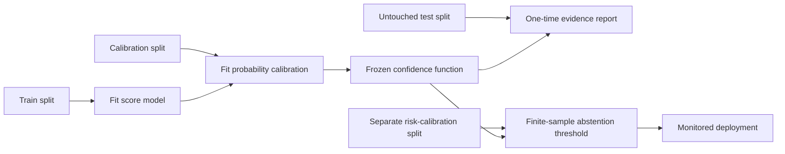

# Kaprekar Geometry

This repository turns the original paper supplement into a verified research package. It now computes exact generalized Kaprekar dynamics—including cycles, raw-weighted basins, convergence depths, graph certificates, and entropy funnels—and implements the paper's normalized logit geometry with the failure cases required for real use.

It does **not** claim that normalized logit gaps improve LLM reliability. That remains an empirical hypothesis, and the included benchmark is designed to falsify it against information-matched baselines.

## Author

Siddharth Nilesh Patel

## Citation and publication

The revised manuscript is *From Kaprekar Dynamics to Logit Geometry: Exact
Compression, Weighted Basins, and Limits of a Sorted-Logit Representation*.
The [authored PDF](output/pdf/kaprekar_geometry_arxiv.pdf), its reproducible
[LaTeX source](paper/arxiv/main.tex), the verified
[arXiv upload bundle](output/arxiv/kaprekar_geometry_arxiv_source.tar.gz), and citation metadata in
[`CITATION.cff`](CITATION.cff) are included in this repository.

The canonical repository is
[github.com/thewisecrab/kaprekar-geometry](https://github.com/thewisecrab/kaprekar-geometry).
The arXiv identifier will be added only after arXiv accepts the submission and
assigns one; no identifier is currently claimed.

## What is established

- `K = Lambda o Sigma` on the fixed-width base-`b` domain.
- `Lambda` is injective on the ordered spectrum set.
- The one-step image contains exactly `comb(b + floor(n/2) - 1, floor(n/2))` states.
- The full dynamics after one step are conjugate to the reduced spectrum graph.
- Raw basin populations are exact multinomial weights, not unweighted spectrum counts.
- For decimal width four, 10 repdigits enter zero and the other 9,990 states enter 6174 within at most seven steps.

The strengthened theory and corrected novelty boundary are in [paper/theory_addendum.md](paper/theory_addendum.md). A self-contained proof ledger and full derivations are in [paper/proof_companion.md](paper/proof_companion.md). A deliberately separate arithmetic and graph implementation, its trusted-computing-base statement, and certificate instructions are in [proofs/README.md](proofs/README.md). The topic-by-topic literature and impact review is in [docs/research_review.md](docs/research_review.md).

## Install

The exact arithmetic and dynamics package has no runtime dependencies:

```bash
python3 -m venv .venv
.venv/bin/python -m pip install -e .
```

Install NumPy only for the empirical benchmark:

```bash
.venv/bin/python -m pip install -e '.[benchmark]'
```

Python 3.10 or newer is required.

## Command line

Run the paper's complete 49-configuration exhaustive check:

```bash
kaprekar verify
```

Use the polynomial-size reduced check for a larger width:

```bash
kaprekar verify --base-min 10 --base-max 10 \
  --digits-min 20 --digits-max 20 --mode reduced --json
```

Compute every cycle, basin, and raw convergence depth:

```bash
kaprekar analyze --base 10 --digits 8 --json
```

Inspect full-distribution and normalized top-k logit features:

```bash
kaprekar logits 8.2 7.9 5.1 4.8 -1.0 --top-k 4 --json
```

The CLI refuses exponential work above declared limits unless `--force` is explicit. Sampled mode reports its seed and sample checksum and never labels a sample as an exhaustive proof.

## Python API

```python
from kaprekar import analyze_functional_graph, uniform_entropy_trajectory

analysis = analyze_functional_graph(10, 6)
for attractor in analysis.attractors:
    print(attractor.cycle_values, attractor.raw_basin_size)

for point in uniform_entropy_trajectory(analysis):
    print(point.iteration, point.support_size, point.entropy_bits)
```

Each state reports its reduced indegree, exact raw indegree, and the number of raw indegree-zero leaves attached to it. `graph_sha256` certifies the ordered transition/weight table used in a result.

## Safe logit geometry

```python
from kaprekar import gap_simplex, relaxed_margin_diagnostic, tail_mass_bounds

summary = gap_simplex([8.2, 7.9, 5.1, 4.8, -1.0], k=4)
print(summary.coordinates, summary.spread)
print(summary.top_k_probability_mass, summary.entropy)
print(tail_mass_bounds(summary, vocabulary_size=5))

audit = relaxed_margin_diagnostic(
    [8.2, 7.9, 5.1, 4.8, -1.0],
    candidate_index=1,
    k=4,
    rho=0.2,
    absolute_margin_cap=1.0,
)
print(audit)
```

Important contracts:

- An all-flat or tolerance-flat spectrum returns `coordinates=None` plus `degenerate=True`; no epsilon-imputed simplex point is invented.
- Sorting is deterministic under ties.
- Full logits produce actual entropy (in nats), max probability, and top-k mass;
  when `k` is smaller than the vocabulary, top-k-only bounds make omitted-tail
  ambiguity visible.
- The margin function is a diagnostic. It does not sample, inspect the draft distribution, or preserve a target distribution.

## Empirical benchmark contract

The benchmark requires three independent `.npz` files. Every file must contain:

- `logits`: finite float array `[samples, vocabulary]`;
- `labels`: binary correctness array `[samples]`;
- `sample_ids`: unique non-object strings or integers `[samples]`;
- `group_ids`: question/sequence/dependency-unit IDs `[samples]`, repeated for
  correlated rows and disjoint across splits; and
- optionally `hidden`: finite array `[samples, hidden_features]`, present in all splits or none.

Run:

```bash
kaprekar benchmark \
  --train data/train.npz \
  --calibration data/calibration.npz \
  --test data/test.npz \
  --top-k 10 --summary-only
```

Any sample- or group-ID overlap fails the run. Models are trained only on
`train`, probability-calibrated only on `calibration`, and evaluated once on
`test`. Confidence intervals resample whole dependency groups rather than
individual correlated rows. The report includes input hashes and compares:

The benchmark cannot infer semantic duplication from logits alone; the data
owner is responsible for assigning every correlated row from the same question,
document, user, or generated sequence to the same group.



- max probability;
- full entropy;
- top-1 margin;
- raw relative sorted top-k logits with the same feature count as KGS;
- sorted top-k probabilities;
- KGS coordinates and spread;
- a tail-aware output hybrid; and
- the same hybrid plus hidden features when supplied.

Metrics include AUROC, average precision, Brier score, NLL, tie-preserving
equal-frequency ECE, threshold-attainable AURC, and the empirical test-set
risk-coverage frontier, with deterministic bootstrap intervals. The latter is
descriptive, not a deployment threshold; production threshold selection uses
the separate risk-calibration procedure below. The result label explicitly
limits evidence to the supplied splits.

## Selective-risk calibration

Production abstention needs a fourth, untouched risk-calibration set after model fitting and probability calibration:

```python
from kaprekar import calibrate_selective_risk, apply_abstention

policy = calibrate_selective_risk(
    risk_calibration_confidences,
    risk_calibration_correctness,
    target_risk=0.10,
    confidence_level=0.95,
)

decisions = apply_abstention(deployment_confidences, policy)
```

This is not described as conformal prediction. It uses exact one-sided binomial
bounds on a fixed threshold grid and a Bonferroni correction for threshold
selection. Its stated guarantee requires a score fixed before an untouched IID
risk-calibration sample from the deployment law. Generic exchangeability is
not sufficient for this binomial guarantee, and it does not survive arbitrary
distribution shift.

## Tests and release verification

Fast suite:

```bash
PYTHONPATH=src python3 -m unittest discover -s tests -v
```

The fast suite intentionally skips optional benchmark tests when NumPy is not
installed. The mandatory release gate requires the benchmark extra and enables
the complete paper grid:

    python3 scripts/release_check.py

Or enable only the 3,816,497-state paper grid:

```bash
KAPREKAR_RUN_SLOW_TESTS=1 PYTHONPATH=src \
  python3 -m unittest discover -s tests -v
```

The original `kaprekar_verification.py` remains executable for manuscript compatibility.

Machine-check the universal even/odd pairing and Kaprekar factorization theorem
with the pinned Lean 4/Mathlib project:

```bash
cd proofs/lean
lake exe cache get
lake build
```

The Lean source contains no `sorry` placeholders or added axioms. CI also asks
two additional checkers, LeanChecker and nanoda, to reject incomplete or
ill-typed proof artifacts.

Generate and then independently recompute the complete finite proof
certificate (49 parameter pairs and 3,816,497 raw states):

```bash
python3 scripts/prove.py --write results/independent_proof_certificate.json
python3 scripts/prove.py --verify results/independent_proof_certificate.json
```

The independent oracle never imports the production package. Its certificate
checks 18 exact obligations per parameter pair, including arithmetic
factorization, image equality and count, injectivity, conjugacy, weights,
indegrees, cycles, basins, and hitting times. This is exhaustive proof of the
declared finite grid; the universal claims still depend on the algebraic proofs
in the proof companion.

Regenerate the JSON evidence and its source-tree certificate:

    python3 scripts/reproduce.py

## Research boundaries

Credible current uses are exact finite-dynamics research, formalization fixtures, algorithm/number-theory education, and a controlled representation benchmark. The project supplies no evidence of cryptographic security, broad industrial deployment, measured learning gains, semantic-correctness guarantees, or state-of-the-art LLM performance.

The anonymous April source paper is preserved unchanged at
[kaprekar_logit_geometry_paper.pdf](kaprekar_logit_geometry_paper.pdf). Its
original LaTeX was not present in the received workspace. The major July
revision is independently rebuildable from [paper/arxiv](paper/arxiv/).

No separate software license has been selected. Public availability does not
itself grant reuse or redistribution rights beyond applicable law; a software
license can be added later if the author chooses to make an open-source grant.
