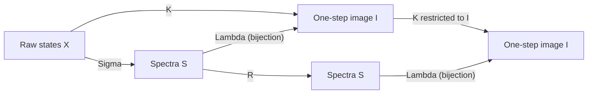

# Theory addendum and revision text

**For:** *From Kaprekar Dynamics to Logit Geometry*
**Research cut-off:** 11 July 2026
**Status:** theorem-grade revision material, computationally implemented in this repository

The original PDF is preserved as the submitted artifact because its LaTeX source is not present. This addendum supplies corrected novelty language, stronger consequences of the proved image theorem, and necessary limits on the logit and speculative-decoding claims.

## 1. Corrections that must precede any new claim

### 1.1 The outer-gap reduction has direct prior art

Prichett, Ludington, and Lapenta explicitly define the arbitrary-base outer-difference tuple and state that the transform depends entirely on it. The manuscript must therefore not present factorization through outer gaps as a newly discovered principle. The defensible contribution is narrower and stronger:

1. the explicit integer linear map \(\Lambda_{b,n}\);
2. its injectivity on the spectrum set;
3. the exact one-step image cardinality;
4. the exact conjugacy, complete-graph, and weighted-basin consequences below; and
5. the proposed normalized-logit reparameterization and its empirical hypotheses.

Primary source: [Prichett, Ludington, and Lapenta (1981)](https://www.fq.math.ca/Scanned/19-1/prichett.pdf).

### 1.2 “Constant” and “fixed point” must not be conflated

The historical literature uses more than one definition. The 1981 paper calls
nonzero fixed points *self-producing integers*. Iwasaki's 2024 classification
calls them *Kaprekar numbers* and reserves *Kaprekar constant* for a fixed point
to which every non-repdigit state of that width converges. Under that latter
definition, 495 and 6174 are the only decimal constants even though longer
decimal widths have many nonzero fixed points.

Use “nonzero fixed point,” “cycle,” and “global attractor” explicitly. Iwasaki also gives an explicit five-family classification and records a correction to the 1981 Class B conditions. Primary source: [Iwasaki (2024)](https://www.fq.math.ca/Papers/62-4/iwasaki06162024-ASrev2.pdf).

### 1.3 The image-cardinality proof needs a one-digit base case

Theorem 3.7 states \(n\geq1\), but its displayed stars-and-bars proof refers to \(\Delta_1\) when \(m=\lfloor n/2\rfloor=0\). For \(n=1\), every subtraction is zero, so the image has one element and the formula gives \(\binom{b-1}{0}=1\). State that case separately.

There is also a cleaner count that handles \(m=0\) uniformly. Define the gap histogram

\[
q_r=|\{j:\Delta_j=r\}|,\qquad r=0,\ldots,b-1.
\]

Weakly decreasing spectra are in bijection with weak compositions

\[
q_0+\cdots+q_{b-1}=m,
\]

so

\[
|S_{b,n}|=\binom{m+b-1}{b-1}.
\]

This reveals a second representation: the spectrum has \(m\) ordered coordinates, but for fixed base it can be stored using \(b\) counts with one sum constraint. Calling \(m\) the unqualified “effective dimension” is therefore misleading; it is the tuple length, while the fixed-base combinatorial degrees of freedom are controlled by \(b-1\).

## 2. Exact post-first-step conjugacy

Let

\[
X_{b,n}=\{0,\ldots,b^n-1\},\qquad
S_{b,n}=\{\Delta\in\mathbb Z^m:b-1\geq\Delta_1\geq\cdots\geq\Delta_m\geq0\},
\]

where \(m=\lfloor n/2\rfloor\). Retain the manuscript's maps

\[
\Sigma:X_{b,n}\to S_{b,n},\qquad
\Lambda:S_{b,n}\to X_{b,n},\qquad
K=\Lambda\circ\Sigma,\qquad
R=\Sigma\circ\Lambda.
\]

For sorted digits \(a_1\geq\cdots\geq a_n\), each actual outer gap satisfies
\(0\leq\Delta_j\leq b-1\), and for \(j<m\),

\[
\Delta_j-\Delta_{j+1}
=(a_j-a_{j+1})+(a_{n-j}-a_{n+1-j})\geq0.
\]

Thus the spectrum of every raw state really lies in \(S_{b,n}\).

These facts can be established without importing an unproved manuscript step.
For every \(\Delta\in S_{b,n}\), the length-\(n\) sorted digit string

\[
(\Delta_1,\ldots,\Delta_m,0,\ldots,0)
\]

has spectrum \(\Delta\); for \(n=1\), this is the unique empty spectrum.
Thus \(\Sigma\) is surjective. Moreover, writing

\[
c_j=b^{n-j}-b^{j-1},
\]

direct summation gives, for \(1\leq j\leq m\),

\[
c_j-(b-1)\sum_{k=j+1}^{m}c_k
=b^{n-m}+b^m-b^j-b^{j-1}>0.
\]

If two spectra first differ at coordinate \(j\), the leading contribution to
their encoded-value difference has magnitude at least \(c_j\), while every
later contribution has total magnitude at most
\((b-1)\sum_{k>j}c_k\). Hence \(\Lambda\) is injective. (When \(m=0\), this
is vacuous.) Since \(K=\Lambda\Sigma\), it follows that

\[
I_{b,n}:=\operatorname{Im}K=\Lambda(S_{b,n}),
\]

and \(\Lambda:S_{b,n}\to I_{b,n}\) is bijective.

### Theorem 2.1 (Exact reduced/full conjugacy)

The restriction \(L:=\Lambda|_{S_{b,n}}:S_{b,n}\to I_{b,n}\) is a bijection and

\[
K|_{I_{b,n}}\circ L=L\circ R.
\]

Therefore \(K|_{I_{b,n}}\) and \(R\) are conjugate finite dynamical systems.

#### Proof

The preceding surjectivity and dominance arguments prove that \(L\) is a
bijection. For every \(\Delta\in S_{b,n}\),

\[
K(L\Delta)
=\Lambda\Sigma\Lambda(\Delta)
=\Lambda R(\Delta)
=L(R\Delta).
\]

This is precisely the conjugacy identity. \(\square\)

### Corollary 2.2 (Complete cycle and transient transfer)

Reduced cycles correspond bijectively to full cycles after the first step, with exactly the same least periods. For every \(x\in X_{b,n}\) and \(t\geq1\),

\[
K^t(x)=\Lambda R^{t-1}\Sigma(x).
\]

Every orbit enters \(I_{b,n}\) in one step. Thus no raw-state cycle, fixed point, or post-first-step transient is hidden by the reduction.

#### Proof

The orbit identity follows by induction from \(K=\Lambda\Sigma\) and \(R=\Sigma\Lambda\). Conjugacy preserves least periods, not merely eventual periodicity. \(\square\)

This theorem replaces the under-justified “correspond” sentence in Corollary 3.5 of the PDF. Semiconjugacy alone would not establish exact period preservation; the injectivity theorem does.

## 3. The complete functional graph, not only its cycles

Define the spectrum-fiber weight

\[
w_{b,n}(\Delta)=|\Sigma^{-1}(\Delta)|.
\]

Let \(\operatorname{indeg}_R(\Delta)\) be the indegree of \(\Delta\) in the reduced functional graph.

### Theorem 3.1 (Full graph from the weighted reduced graph)

The full functional graph of \(K\) is obtained by:

1. relabeling every reduced vertex \(\Delta\) as \(\Lambda(\Delta)\); and
2. attaching exactly

\[
w_{b,n}(\Delta)-\operatorname{indeg}_R(\Delta)
\]

additional indegree-zero source leaves to \(\Lambda(\Delta)\).

Equivalently,

\[
\operatorname{indeg}_K(\Lambda\Delta)=w_{b,n}(\Delta),
\]

and every vertex outside \(I_{b,n}\) has indegree zero.

#### Proof

For any raw state \(x\),

\[
K(x)=\Lambda\Sigma(x).
\]

Because \(\Lambda\) is injective, \(K(x)=\Lambda\Delta\) if and only if \(\Sigma(x)=\Delta\). Hence the full indegree is \(w_{b,n}(\Delta)\). The preimages that already lie in \(I_{b,n}\) have the form \(x=\Lambda\Delta'\), and

\[
K(\Lambda\Delta')=\Lambda R(\Delta')=\Lambda\Delta
\]

if and only if \(R(\Delta')=\Delta\). There are \(\operatorname{indeg}_R(\Delta)\) such preimages. All remaining preimages are outside the image and therefore have indegree zero by definition of \(I_{b,n}\). \(\square\)

This is stronger than a state-count reduction: it is an exact compressed
representation of the entire directed graph up to relabeling of the anonymous
raw source leaves. Recovering the original integer label of every leaf still requires
enumerating or otherwise describing each spectrum fiber.

## 4. Exact raw basin weights in polynomial time for fixed base

Let \(a=(a_1,\ldots,a_n)\) satisfy
\(b-1\geq a_1\geq\cdots\geq a_n\geq0\), and let \(c_d(a)\) count
occurrences of digit \(d\). Every permutation of the multiset has the same
spectrum, and the number of distinct ordered strings represented by \(a\) is

\[
\operatorname{mult}(a)=\frac{n!}{\prod_{d=0}^{b-1}c_d(a)!}.
\]

Therefore

\[
w_{b,n}(\Delta)
=\sum_{\substack{b-1\geq a_1\geq\cdots\geq a_n\geq0\\
                  a_j-a_{n+1-j}=\Delta_j}}
  \frac{n!}{\prod_{d=0}^{b-1}c_d(a)!}.
\]

### Theorem 4.1 (Weighted-basin formula)

Let \(C\subseteq S_{b,n}\) be a cycle of \(R\), and let

\[
B_R(C)=\{\Delta:R^t(\Delta)\in C\text{ for some }t\geq0\}.
\]

Then the corresponding full cycle is \(\Lambda(C)\), and its exact raw basin size is

\[
|B_K(\Lambda C)|=\sum_{\Delta\in B_R(C)}w_{b,n}(\Delta).
\]

#### Proof

The spectrum fibers partition \(X_{b,n}\). By Corollary 2.2, a raw state \(x\) reaches \(\Lambda(C)\) if and only if \(\Sigma(x)\) reaches \(C\) under \(R\). Summing the sizes of exactly those fibers gives the result. \(\square\)

### Corollary 4.2 (Exact hitting-time histogram)

Let \(d_R(\Delta,C)\) be the least \(t\) such that \(R^t(\Delta)\in C\).

- If \(\Delta\notin C\), every state in \(\Sigma^{-1}(\Delta)\) has raw hitting time \(d_R(\Delta,C)+1\).
- If \(\Delta\in C\), exactly one state in that fiber is already on \(\Lambda(C)\), while the remaining \(w_{b,n}(\Delta)-1\) states reach the cycle in one step.

Thus maximum depth, mean depth, and the complete raw depth histogram are all recoverable without enumerating \(b^n\) raw strings.

#### Proof

If \(\Delta\notin C\) and \(d=d_R(\Delta,C)\), Corollary 2.2 gives

\[
K^t(x)=\Lambda R^{t-1}(\Delta),\qquad t\geq1.
\]

Injectivity of \(\Lambda\) shows that the first cycle entry occurs at
\(t=d+1\). It cannot occur at \(t=0\): if
\(x=\Lambda\gamma\in\Lambda(C)\), then \(\Sigma x=R\gamma\in C\),
contradicting \(\Sigma x=\Delta\notin C\). If \(\Delta\in C\), the
restriction \(R|_C\) is a cyclic
permutation, so \(\Delta\) has exactly one predecessor \(\gamma\in C\).
The unique cycle state in \(\Sigma^{-1}(\Delta)\) is \(\Lambda\gamma\): it has
spectrum \(R(\gamma)=\Delta\), and injectivity rules out a second such cycle
state. Every other state in that fiber maps to \(\Lambda\Delta\) in one step.
\(\square\)

### Corollary 4.3 (Fixed-base complexity)

There are

\[
|S_{b,n}|=\binom{b+\lfloor n/2\rfloor-1}{b-1}
\]

reduced states and

\[
M_{b,n}=\binom{b+n-1}{b-1}
\]

sorted digit multisets. For fixed \(b\), both are \(\Theta(n^{b-1})\). Each
state transition, multinomial weight, and graph traversal uses a polynomial
number of arithmetic operations on integers whose bit lengths are polynomial
in \(n\). Consequently, for every fixed \(b\), there is a polynomial-time
exact algorithm in the standard bit model for constructing the reduced graph
and exact raw fiber weights, rather than enumerating the \(b^n\) raw states.

The implementation in `src/kaprekar/dynamics.py` follows this argument directly.

### Theorem 4.4 (Exact entropy funnel for every input law)

Let \(X\) be a random raw state with any distribution \(\mu\), and let \(\nu=\Sigma_*\mu\) be its induced spectrum law. For every \(t\geq1\),

\[
(K^t)_*\mu
=\Lambda_* (R^{t-1})_*\nu.
\]

Because \(\Lambda\) is injective on \(S_{b,n}\), discrete Shannon entropy is preserved by this relabeling:

\[
H(K^t(X))=H(R^{t-1}(\Sigma X)).
\]

Under the uniform raw law,

\[
\nu(\Delta)=\frac{w_{b,n}(\Delta)}{b^n}.
\]

Thus entropy decay, attractor probabilities, and convergence statistics are exact weighted consequences of the reduced deterministic graph. They do not require a coarse empirical Markov approximation.

#### Proof

The pushforward identity is Corollary 2.2 applied to a random input. An injective deterministic relabeling preserves every atom probability and therefore preserves discrete Shannon entropy. \(\square\)

### Certified computation 4.5 (The fixed-point table hides the dominant dynamics)

Exact weighted analysis of the decimal systems gives the following raw-input basin shares, including leading zeros:

| Width | Nonzero attractor | Exact raw basin size | Raw basin share |
|---:|---|---:|---:|
| 5 | cycle \((53955,59994)\) | 3,190 | 3.190% |
| 5 | 4-cycle through 63954 | 48,480 | 48.480% |
| 5 | 4-cycle through 74943 | 48,320 | 48.320% |
| 6 | fixed point 549945 | 1,950 | 0.195% |
| 6 | fixed point 631764 | 62,520 | 6.252% |
| 6 | 7-cycle through 851742 | 935,520 | 93.552% |
| 7 | 8-cycle through 8429652 | 9,999,990 | 99.9999% |
| 8 | fixed point 63317664 | 599,536 | 0.599536% |
| 8 | fixed point 97508421 | 2,371,040 | 2.371040% |
| 8 | 3-cycle through 86526432 | 48,247,316 | 48.247316% |
| 8 | 7-cycle through 86326632 | 48,782,098 | 48.782098% |

The omitted raw basin in each width is the ten repdigits leading to zero. The
ordered transition-and-weight tables are independently bound by these SHA-256
digests in `results/decimal_dynamics.json`:

| Width | Graph SHA-256 |
|---:|---|
| 5 | `1bc934e32801c08dff5f07b9a8e914a562f6344c979306aede616c483a1c60de` |
| 6 | `aabc5c5dbe49e36de7a758760fbd5a0547796ae2d31e501f29ca1fc5644b4ecc` |
| 7 | `56c2c45bc885f5c42955f596e2f5da6087d55d35e631cd6c9d910fa3464a2450` |
| 8 | `10876a84704856f220ad0488c76c7765590286b4728cf57e4c77df0fbd46b1d6` |

These are finite, reproducible certificates rather than universal theorems.
The mandatory release suite recomputes the width-5 through width-8 cycles,
weights, basin sizes, and hitting-time histograms with the separate
`proofs/independent_oracle.py` implementation before comparing them with the
production analysis.
The result is consequential: for widths 5--8, a fixed-point-only presentation
usually describes a minority—or none—of the observed dynamics.

## 5. A reusable injectivity theorem

### Lemma 5.1 (Superincreasing integer code)

Let \(b\geq2\) and \(m\geq0\). Let \(c_1,\ldots,c_m\) be positive integers
satisfying

\[
c_j>(b-1)\sum_{k=j+1}^{m}c_k
\quad\text{for every }j.
\]

Then \(F(d)=\sum_jc_jd_j\) is injective on the entire cube
\(\{0,\ldots,b-1\}^m\), and hence on every subset such as \(S_{b,n}\). For
\(m=0\), the domain is a singleton and the statement is vacuous.

#### Proof

For distinct \(d,d'\), let \(j\) be their first differing coordinate and swap them if necessary so that \(d_j-d'_j\geq1\). Then

\[
F(d)-F(d')
\geq c_j-(b-1)\sum_{k>j}c_k>0.
\]

Thus no two code words collide. \(\square\)

### Corollary 5.2 (Kaprekar coefficients are superincreasing)

For

\[
c_j=b^{n-j}-b^{j-1},\qquad m=\lfloor n/2\rfloor,
\]

direct summation gives

\[
c_j-(b-1)\sum_{k=j+1}^{m}c_k
=b^{n-m}+b^m-b^j-b^{j-1}>0.
\]

Indeed, for \(j\leq m\),

\[
b^j+b^{j-1}\leq b^m+b^{m-1}
<2b^m\leq b^{n-m}+b^m,
\]

because \(n-m\geq m\). This explicitly proves the strict inequality.

Hence the manuscript's injectivity result is an instance of a general positional-code theorem. This abstraction may apply to other digit-rearrangement maps whose paired coefficients satisfy the same dominance condition.

## 6. Quantifying the one-step information collapse

### Corollary 6.1 (Asymptotic compression)

For fixed \(b\) and \(m=\lfloor n/2\rfloor\),

\[
|\operatorname{Im}K_{b,n}|
=\binom{b+m-1}{b-1}
\sim\frac{m^{b-1}}{(b-1)!}.
\]

Therefore

\[
\frac{|\operatorname{Im}K_{b,n}|}{b^n}\to0
\]

exponentially fast, and the mean fiber size when image states are weighted
uniformly is

\[
\frac{b^n}{\binom{b+m-1}{b-1}}.
\]

For a uniform raw input \(X\), the exact one-step Shannon information loss is

\[
H(X\mid K(X))
=\sum_{\Delta\in S_{b,n}}\frac{w_{b,n}(\Delta)}{b^n}
  \log_2 w_{b,n}(\Delta)
=n\log_2 b-H(K(X)).
\]

Since \(H(K(X))\leq\log_2|\operatorname{Im}K_{b,n}|\), it is bounded below by

\[
n\log_2b-\log_2\binom{b+m-1}{b-1}
\]

bits. Equality holds only when the one-step image distribution is uniform;
the weighted entropy computation in Theorem 4.4 gives the exact value.

#### Proof

For fixed \(b\), expanding the \(b-1\) factors in the binomial coefficient
gives

\[
\binom{m+b-1}{b-1}
=\frac{m^{b-1}}{(b-1)!}+O(m^{b-2}).
\]

Since \(m=\lfloor n/2\rfloor\), its logarithm is \(O(\log n)\), whereas
\(\log b^n=n\log b\); this proves exponential decay of the image ratio.
The fibers partition all \(b^n\) raw states, so their arithmetic mean over the
image is \(b^n/|\operatorname{Im}K|\).

For uniform \(X\), conditioning on \(K(X)=\Lambda\Delta\) leaves a uniform
choice among exactly \(w_{b,n}(\Delta)\) raw states. Averaging the conditional
entropy \(\log_2 w_{b,n}(\Delta)\) proves the sum formula. Equivalently, since
\(K\) is deterministic,
\(H(X\mid K(X))=H(X)-H(K(X))=n\log_2b-H(K(X))\). Finally, entropy on a support
of size \(|\operatorname{Im}K|\) is at most its logarithm, with equality exactly
for the uniform law. \(\square\)

As an engineering consequence—not a cryptographic theorem—this gives a
concrete negative consequence as well as a useful reduction. The
problem is not merely that the map is many-to-one—cryptographic hashes are too—
but that its image is only polynomial in \(n\) for fixed base and its large
collision fibers are efficiently constructible. It must not be presented as a
cryptographic hash, entropy source, or reversible encoding.

## 7. Four-digit odd bases after the April manuscript

Chen, Ono, Schwartz, and Thakur proved in June 2026 that for every odd base \(B>3\), every nonconstant four-digit orbit enters an explicit forward-invariant triangular region within at most three difference-coordinate steps. A half-sum/half-difference transformation then conjugates the stable dynamics to projective doubling on unordered pairs,

\[
\{[r],[s]\}\longmapsto\{[2r],[2s]\}.
\]

This yields complete terminal-cycle descriptions and counts, a maximum terminal-cycle length of at most \((B-1)/2\), and a sharp equality criterion for certain primes. It is materially stronger than generic finite-state enumeration for this regime and should be a dedicated refinement after the general reduction theorem.

Primary sources: [paper](https://arxiv.org/abs/2606.20439), [Lean artifact](https://github.com/AxiomMath/kaprekar4).

The repository's generic graph certificate is complementary: it covers arbitrary \((b,n)\), while the 2026 theorem explains the number-theoretic structure for odd-base four-digit systems.

## 8. Corrected logit-space theory

Let \(k\geq2\), \(s_1\geq\cdots\geq s_k\), \(D=s_1-s_k>0\), and

\[
u_j=\frac{s_j-s_{j+1}}{D},\qquad j=1,\ldots,k-1.
\]

### Theorem 8.1 (Exact information content)

For every \(i\),

\[
s_i-s_k=D\sum_{j=i}^{k-1}u_j.
\]

Consequently:

1. \(u\) is a bijective coordinate on sorted top-k logits modulo positive scaling and additive translation;
2. \((D,u)\) is a bijective coordinate modulo additive translation; and
3. \((D,u)\) exactly determines the top-k-conditional softmax distribution.

The simplex has \(k-1\) coordinates constrained to sum to one, hence affine dimension \(k-2\). Under standard notation it is \(\Delta^{k-2}\), not a \((k-1)\)-dimensional object. For \(k=2\), \(u=(1)\) always and contains no shape information.

The exact bridge to the digit construction is the shared interval-sum operator.
For \(1\leq j\leq\lfloor n/2\rfloor\) in the digit identity and
\(1\leq j\leq\lfloor k/2\rfloor\) in the logit identity,

\[
a_j-a_{n+1-j}=\sum_{i=j}^{n-j}(a_i-a_{i+1}),
\qquad
s_j-s_{k+1-j}=D\sum_{i=j}^{k-j}u_i.
\]

Thus outer-pair profiles in both settings are cumulative adjacent gaps. This is the precise common structure; it should replace broader analogy-based language.

### Corollary 8.2 (No information-creation claim)

Define the translation-quotiented sorted vector

\[
r(s)=(s_1-s_k,\ldots,s_{k-1}-s_k,0).
\]

The maps \(r(s)\leftrightarrow(D,u)\) are bijections. Therefore these two
observations have identical Bayes-optimal risk for every prediction target and
loss. Since \((D,u)\) is a deterministic function of the full sorted logits,
the Bayes risk using the full vector is no larger. Equality for every decision
problem is guaranteed by the sufficiency condition
\(Y\perp s_k\mid r(s)\), or by an explicitly shift-invariant observation
model. A particular target and loss may have equal risk accidentally even when
that condition fails.

This qualification matters: a varying common offset can itself predict the
target while leaving \((D,u)\) unchanged. Accordingly, the information-matched
benchmark is relative sorted logits, while unrestricted raw logits are a
potentially richer baseline. Improvements over the information-matched
baseline can only arise from finite-sample inductive bias, regularization,
numerical conditioning, or model-capacity constraints—not information
creation.

### Proposition 8.3 (The flat spectrum is a genuine singular case)

For \(k\geq3\), the normalized coordinate map has no continuous extension to \(D=0\).

#### Proof

Choose two distinct simplex points \(u\neq v\). For \(\epsilon>0\), reconstruct sorted vectors \(s(\epsilon,u)\) and \(s(\epsilon,v)\) with spread \(\epsilon\) and bottom logit zero. Both vectors converge to the same all-zero vector as \(\epsilon\to0\), while their normalized coordinates remain \(u\) and \(v\). A continuous extension would therefore need two distinct values at the same flat vector. \(\square\)

Implementations must expose a degeneracy flag rather than silently divide by an epsilon or impute an ordinary simplex point.

### Proposition 8.4 (Near-flat sensitivity)

Let \(s,t\) be two sorted top-k vectors with spreads \(D_s,D_t\geq d>0\) and \(\|s-t\|_\infty\leq\varepsilon\). Then their normalized adjacent gaps satisfy

\[
\|u(s)-u(t)\|_\infty\leq\frac{4\varepsilon}{d}.
\]

#### Proof

Each adjacent unnormalized gap changes by at most \(2\varepsilon\), and the spread changes by at most \(2\varepsilon\). For a gap \(g'\leq D_t\),

\[
\left|\frac{g}{D_s}-\frac{g'}{D_t}\right|
\leq\frac{|g-g'|}{D_s}
+\frac{g'|D_t-D_s|}{D_sD_t}
\leq\frac{4\varepsilon}{d}.
\]

\(\square\)

The \(1/d\) factor is unavoidable: normalized shape becomes ill-conditioned near the flat stratum. Token membership at the top-k cutoff has an additional discontinuity under ties even though the sorted order-statistic values themselves are stable.

### Proposition 8.5 (Exact change-of-k relation)

Suppose a nondegenerate top-k spectrum is extended by \(s_{k+1}\leq s_k\). Let \(D'=s_1-s_{k+1}\). Then

\[
u'_j=\frac{D}{D'}u_j\quad(1\leq j<k),
\qquad
u'_k=\frac{s_k-s_{k+1}}{D'}.
\]

Thus changing \(k\) predictably rescales every existing coordinate. KGS is not invariant to the top-k choice; a benchmark must include a k-sweep or multiscale representation.

### Theorem 8.6 (Sharp omitted-tail bounds)

Let the vocabulary size be \(V\geq k\), define

\[
r_i=s_i-s_k=D\sum_{j=i}^{k-1}u_j,
\qquad
A=\sum_{i=1}^{k}e^{r_i},
\]

and assume only that each omitted logit is at most \(s_k\). Write its partition
mass relative to \(e^{s_k}\) as

\[
T=\sum_{\ell>k}e^{z_\ell-s_k}.
\]

Then \(0\leq T\leq V-k\),

\[
M_k=\frac{A}{A+T},\qquad p_1=\frac{e^D}{A+T},
\]

and hence the full-distribution top-k mass \(M_k\) and top-token probability
\(p_1\) satisfy

\[
\frac{A}{A+V-k}\leq M_k\leq1,
\]

and

\[
\frac{e^D}{A+V-k}\leq p_1\leq\frac{e^D}{A}.
\]

The lower bounds occur when all omitted logits tie \(s_k\). If \(V=k\), then
\(T=0\), both upper bounds are attained, and \((D,u)\) determines the complete
softmax distribution. If \(V>k\) and all logits are finite, the upper bounds
are strict but sharp suprema as the omitted logits tend to minus infinity. In
this genuine-tail case, \((D,u)\) does not determine full-vocabulary entropy,
tail mass, or unconditional top-token probability.

To see the entropy claim explicitly, let \(P\) be the top-k-conditional law and
give one omitted token relative weight \(t\in(0,1]\), with any remaining tail
weights tending to zero. If \(q=t/(A+t)\), the limiting full entropy is

\[
h_2(q)+(1-q)H(P),
\]

where \(h_2\) is binary entropy in the same logarithm base as \(H\). This is
not a constant function of \(q\). Two sufficiently small positive
finite tail weights therefore give the same \((D,u)\) and different entropy.
With at least two omitted tokens, redistributing a fixed positive tail mass
also changes the within-tail entropy while preserving \((D,u)\) and \(T\).

If one additionally records

\[
\tau=\operatorname{logsumexp}(z_{\mathrm{tail}})-s_k,
\]

then the omitted partition mass relative to \(e^{s_k}\) is exactly \(e^\tau\), and \((D,u,\tau)\) determines every top-k full-softmax probability. The implementation reports the equivalent actual top-k probability mass whenever the full vector is available.
When \(V=k\), use the empty-tail convention \(\tau=-\infty\), so
\(e^\tau=0\).

### Corollary 8.7 (Exact rank-r probability ratio)

For \(1\leq r\leq k\), the full softmax probabilities satisfy

\[
\frac{p_r}{p_1}
=\exp\left(-D\sum_{j=1}^{r-1}u_j\right).
\]

This equality is the strongest distributional statement supplied by the normalized gaps. It is local to the target distribution and is not a semantic-correctness or speculative-acceptance certificate.

The implementation in `src/kaprekar/logits.py` handles ties, the flat stratum, tail bounds, exact ratios, and full-distribution entropy without pretending these features establish correctness.

### Proposition 8.8 (Correct no-free-lunch statement)

Fix any measurable proposed correctness probability \(q:\mathbb R^V\to[0,1]\). There exist two joint laws \(P\) and \(Q\) with the same deterministic logit vector \(Z=z_0\), but with \(Y=1\) almost surely under \(P\) and \(Y=0\) almost surely under \(Q\). Therefore \(q(Z)\) cannot equal the conditional correctness probability under both laws, and

\[
\max\{\operatorname{Brier}_P(q),\operatorname{Brier}_Q(q)\}
=\max\{(1-q(z_0))^2,q(z_0)^2\}\geq\frac14.
\]

This proves that distribution-free correctness calibration is impossible without structural assumptions or labeled calibration. It does **not** prove that logits are insufficient within a fixed data-generating process, nor that hidden-state probes must be better. The same adversarial construction applies to any fixed hybrid observable. Hybridization remains an empirical hypothesis and prediction P2 must not be claimed as a consequence of this proposition.

## 9. Why the proposed relaxed rule is not distribution-preserving

Let a draft token \(X\) be proposed from \(q\), and let \(a(x)\in[0,1]\) be
any acceptance probability. Define \(A=\sum_yq(y)a(y)\). When \(A>0\),
conditional on acceptance,

\[
\Pr(X=x\mid\text{accepted})
=\frac{q(x)a(x)}{\sum_yq(y)a(y)}.
\]

### Proposition 9.1 (Exact acceptance/residual decomposition)

Suppose that after a rejection the algorithm draws a replacement from a
residual distribution \(h\), and set

\[
r=1-\sum_y q(y)a(y).
\]

The overall output distribution equals the target \(p\) if and only if

\[
q(x)a(x)+r h(x)=p(x)
\quad\text{for every }x.
\]

When \(r>0\), this is possible exactly when \(q(x)a(x)\leq p(x)\) for every
\(x\), in which case

\[
h(x)=\frac{p(x)-q(x)a(x)}{r}.
\]

When \(r=0\), rejection never occurs and exactness holds if and only if
\(q(x)a(x)=p(x)\) for every \(x\). Since the accepted mass then sums to one,
this is equivalent to \(q=p\) and \(a(x)=1\) on the support of \(q\), with
acceptance choices on \(q\)-null points irrelevant.

The standard maximal-acceptance choice is
\(a(x)=\min\{1,p(x)/q(x)\}\) when \(q(x)>0\); when \(q(x)=0\), \(a(x)\) is
arbitrary because the proposal never occurs. Defining accepted mass directly
by \(q(x)a(x)=\min\{p(x),q(x)\}\), the residual restores the remaining target
mass. Its maximum total acceptance probability is the exact identity

\[
A_{\max}=\sum_x\min\{p(x),q(x)\}=1-\operatorname{TV}(p,q).
\]

Maximality is componentwise: exactness with \(r>0\) requires \(qa\leq p\),
while \(a\leq1\) gives \(qa\leq q\). Thus
\(q(x)a(x)\leq\min\{p(x),q(x)\}\) for every \(x\), and the standard choice
attains this upper bound at every coordinate.

A rule depending only on target rank or target margin omits \(q\); without a
matching residual construction it does not preserve \(p\) in general.

#### Proof

The first identity is the law of total probability over acceptance and
rejection. When \(r>0\), solving it for \(h\) gives the displayed residual.
Nonnegativity of \(h\) is equivalent to \(qa\leq p\), and summing the numerator
gives \(r\), so \(h\) is normalized. When \(r=0\), the residual term vanishes,
giving the stated componentwise condition directly. Finally,
\(\min(p,q)=(p+q-|p-q|)/2\); summing over \(x\) yields
\(A_{\max}=1-\tfrac12\sum_x|p(x)-q(x)|=1-\operatorname{TV}(p,q)\).
\(\square\)

The earlier identity for
\(\Pr(X=x\mid\text{accepted})\) characterizes accepted proposals alone. That
conditional distribution equals \(p\) only in the special case
\(q(x)a(x)=c\,p(x)\); this is not required of exact speculative sampling
because its rejection residual completes the distribution.

For example, if \(q=(0.5,0.5)\), \(p=(0.6,0.4)\), and a relaxed rule accepts either candidate, the accepted distribution remains \(q\), not \(p\).

The manuscript must distinguish:

1. **exact speculative sampling**, which uses modified rejection sampling and a residual correction to preserve \(p\);
2. **relaxed verification**, which intentionally changes the distribution and must measure that change; and
3. **semantic or judge-based decoding**, which optimizes a downstream quality criterion rather than distributional identity.

Foundational exact methods: [Leviathan, Kalman, and Matias (2023)](https://arxiv.org/abs/2211.17192), [Chen et al. (2023)](https://arxiv.org/abs/2302.01318).

The normalized rule also needs an absolute cap. Since \(\rho=1\) accepts every selected top-k rank and a fixed \(\rho\) allows arbitrarily weak ratios as \(D\) grows, use the dual condition

\[
\frac{s_1-s_r}{D}\leq\rho
\quad\text{and}\quad
s_1-s_r\leq\varepsilon.
\]

The second inequality supplies the interpretable guarantee \(p_r/p_1\geq e^{-\varepsilon}\). Even with this cap, the result is an approximate logit-regret gate, not exact speculative sampling. A safe lossless use is to let the geometry choose draft length or verification effort while leaving the standard \(p/q\) accept-and-correct rule unchanged.

The current manuscript also has a direct novelty collision. [MARS](https://arxiv.org/abs/2601.15498) already studies target-logit low-margin relaxed verification at scale. The later [acceptance-certificate theory](https://arxiv.org/abs/2606.30265) gives exact KL rejection certificates and sharp margin bounds across strict, relaxed, top-m, entropy, and tree rules. The PDF's ratio lemma remains correct, but it should be presented as an elementary target-band identity and compared with these stronger results.

## 10. What an empirical claim must now beat

An honest benchmark must include all of the following.

### Information-matched ablations

- same-capacity learner on relative sorted top-k logits (information matched),
  plus unrestricted sorted logits as a potentially richer offset control;
- \(u\)-only, \(D\)-only, and \((D,u)\);
- token identities and tail log-mass;
- max probability, entropy, raw margin, and top-k conditional entropy;
- multiple \(k\) values and temperature rescaling.

### Current direct competitors

- [Logit Magnitude and generation-efficient uncertainty](https://arxiv.org/abs/2605.06053);
- [LogTokU / Estimating LLM Uncertainty with Evidence](https://arxiv.org/abs/2502.00290);
- [entropy plus correctness probes](https://arxiv.org/abs/2603.21172);
- [Min-k local sorted-logit geometry](https://arxiv.org/abs/2604.11012);
- semantic-entropy or low-sample semantic baselines; and
- hidden-state probes and hybrid output-plus-probe models.

### Deployment-facing evaluation

- within-domain and cross-domain splits;
- cross-model, cross-scale, quantization, temperature, prompt-style, and temporal shifts;
- AUROC, AUPRC, Brier score, NLL, risk-coverage/AURC, coverage at a fixed target risk, and confidence intervals;
- latency, memory, and end-to-end utility, not discrimination alone; and
- train, calibration, and untouched test partitions separated at the sequence/question level.

Conformal guarantees must name the prediction target, nonconformity score, calibration set, quantile/tie rule, and assumption. Ordinary split-conformal coverage is marginal under exchangeability; it does not automatically imply conditional or selective risk control after arbitrary shift. Relevant stronger current work includes [SCoRE](https://arxiv.org/abs/2603.24704), [adaptive conformal factuality](https://arxiv.org/abs/2604.13991), and [ORCA](https://arxiv.org/abs/2604.01170).

## 11. Evidence labels for the revised abstract

- **Established here:** explicit \(\Lambda\), superincreasing injectivity, exact image size, exact conjugacy, complete weighted-graph representation, and polynomial fixed-base basin computation.
- **Established elsewhere:** classical outer-gap dependence, modern fixed-point classifications, odd-base four-digit projective doubling, and paper-specific UQ/speculative-decoding results.
- **Implemented diagnostic:** normalized logit coordinates, degenerate/tail handling, exact ratio identities, and a benchmark contract.
- **Promising but unvalidated:** any predictive advantage of KGS, production routing, abstention, or speedup.
- **Unsupported and removed:** semantic correctness guarantees from logits, state-of-the-art performance without experiments, cryptographic utility, broad industrial deployment, or measured educational impact.

The strengthened paper is therefore more valuable precisely because it is narrower: it contributes exact finite-dynamics structure and a falsifiable logit representation, while making the operational consequences and failure modes explicit.
